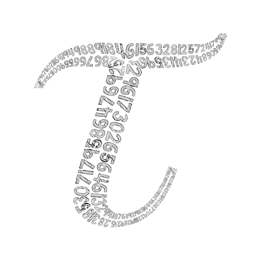

# tau.py - micrography creation tool



tau.py is the tool to draw the input image and text as a micrography. 

## Sample output


## Install/Usage

Please note that this software is at alpha/proof-of-concept stage at the moment. 

```
pip3 install -r requirements.txt
python3 tau.py -h
```

Vector renderer (SVG output)
```
python3 tau.py -i samples/tree.png -t "Quick Brown Fox Jumped Over the Lazy Dog" -f fonts/Calligraffitti-Regular.ttf -r vector -o samples/out_tree.svg
```

## How it works?

Input image must be a binary B&W image, shapes/blobs in white color on black background.

Each blob is processed separately. The medial axis transform is used to compute the skeletons of blobs. 
Skeleton image is thickened with diamond convolution filter. Outer contours of blobs and inner contours of skeleton images are paired together.


For each pair of inner and outer contours, dynamic time warping algorithm is used to optimally align/match points on inner and outer contours.


Text is projected/warped to follow the line segments.


Text projection into paths are implemented by the renderer in use:

 * Raster renderer crops and projects the rasterized text image to the output image as a bitmap.

 * Vector renderer slices and projects glyphs directly to the output buffer as shapes.


## Credits/References

 * [dhermes/bezier](https://github.com/dhermes/bezier) for Bezier curve intersection and splitting.

 * Gooch, Bruce et al. “Automatic Painting with Economized Strokes.” (2012) for the idea to use Medial Axis Transform.

 * Jitsion for the idea and lapopart for inspiration way back in 2009.


